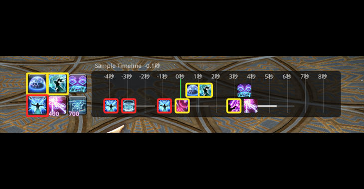

# Oracle

[English](README.md)

緩和・スキルタイミング用の **デューティタイムラインキュー** を表示する Dalamud プラグインです。

ゾーン・ジョブ・シーンに合わせてタイムラインを紐づけます。カウントダウン到達時（または戦闘開始時）に時計が動き、オーバーレイと任意のホットバーハイライトで今後のアクションを示します。

## 機能

- **タイムラインエディタ** — 時間オフセットのキュー（アクション／メモ）、ゾーン・ジョブ・SceneId による自動ロード、手動ロードコマンド
- **オーバーレイ** — リスト（今後の行）と Major（スクロールするアイコンレーン）
- **アクションハイライト** — 前後ウィンドウと任意の点滅、任意のホットバーアイコンハイライト
- **FFLogs インポート** — レポートの詠唱を新しいタイムラインへ（API 認証情報は設定から）
- **AutoRecord** — 選択したコンテンツで自分のアクションを記録し、タイムラインへ取り込み
- **i18n** — UI 文字列の英語／日本語（設定で切替可）

## コマンド

| コマンド | 説明 |
| --- | --- |
| `/oracle` / `/or` | タイムライン画面の表示切替 |
| `/oracle s` | プラグイン設定の表示切替 |
| `/oracle overlay` | リストオーバーレイの表示切替 |
| `/oracle ar` | AutoRecord オーバーレイの表示切替 |
| `/oracle load <name>` | 名前でタイムラインをロード |
| `/oracle countdown <sec>` | テスト用カウントダウンを注入 |
| `/oracle preview` / `preview stop` | 戦闘なしでタイムラインをプレビュー |
| `/oracle reset` | 時計をリセット |
| `/oracle help` | ヘルプを表示 |

AutoRecord 関連の設定トグルは `/oracle setting …` からも利用できます（ゲーム内ヘルプ参照）。

## 動作環境

- [XIVLauncher](https://goatcorp.github.io/) / Dalamud
- Final Fantasy XIV（Windows）

## インストール（開発）

1. ビルド: `dotnet build Oracle.sln -c Release -p:Platform=x64`
2. Dalamud の **dev plugin** パスを `Oracle/bin/Release/` に向ける
3. プラグインインストーラ（dev）で **Oracle** を有効化

共有 UI キットとして [MirageUI](https://github.com/exatrines/MirageUI) を git サブモジュールで同梱しています。

## スクリーンショット

## ライセンス

[AGPL-3.0-or-later](LICENSE) — Dalamud プラグインでよく使われる系統のライセンスです。

## 免責

Oracle は非公式のサードパーティ製ツールであり、Square Enix および Dalamud プロジェクトとは無関係です。自己責任で利用し、ゲームの利用規約および Dalamud のプラグインガイドラインに従ってください。
